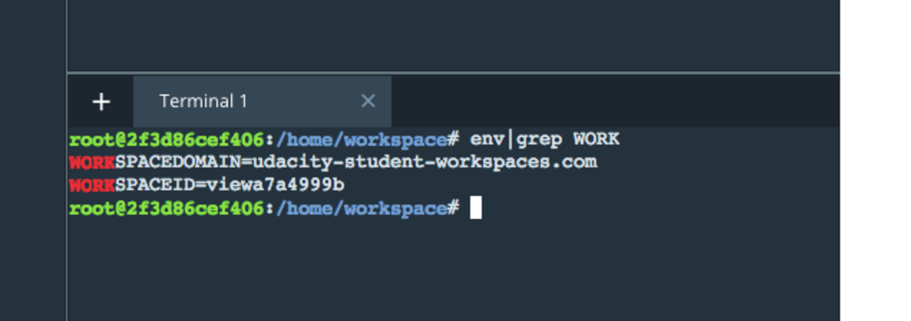

# Disaster Response Pipeline Project

### Instructions:
1. Run the following commands to set up the database and model.

    - To run ETL pipeline that cleans data and stores in database:

        `python data/process_data.py data/disaster_messages.csv data/disaster_categories.csv data/DisasterResponse.db`

    - To run ML pipeline that trains classifier and saves:

        `python models/train_classifier.py data/DisasterResponse.db models/classifier.pkl`

2. Run the following command in the app's directory to run the web app:

    `python run.py`

3. Open another Terminal Window and type:

    `env|grep WORK`

   The output that looks something like this:
   

   In a new web browser window, type in the following:

   `https://SPACEID-3001.SPACEDOMAIN`

  
